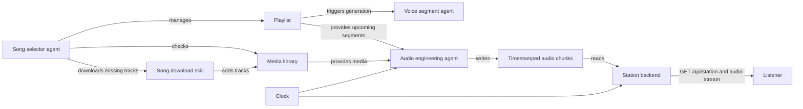
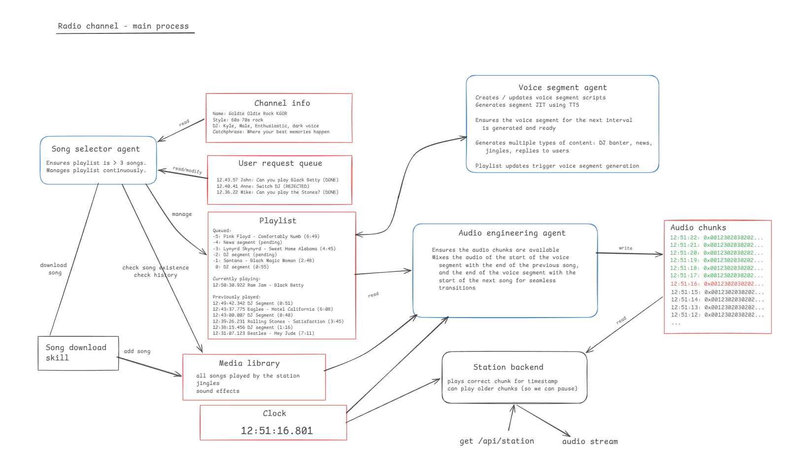
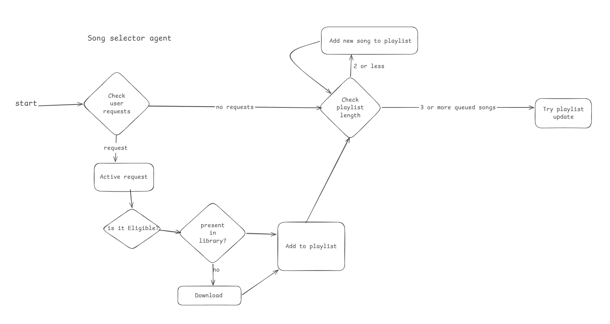
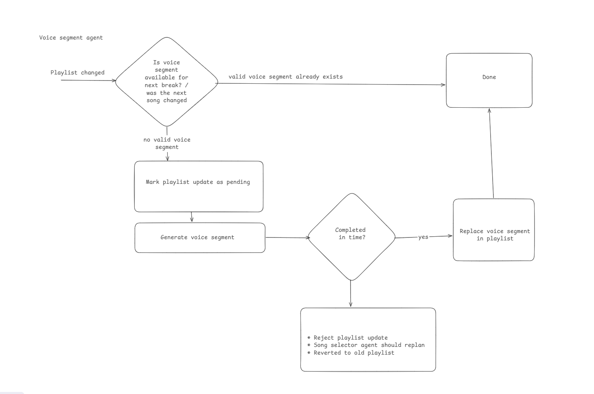
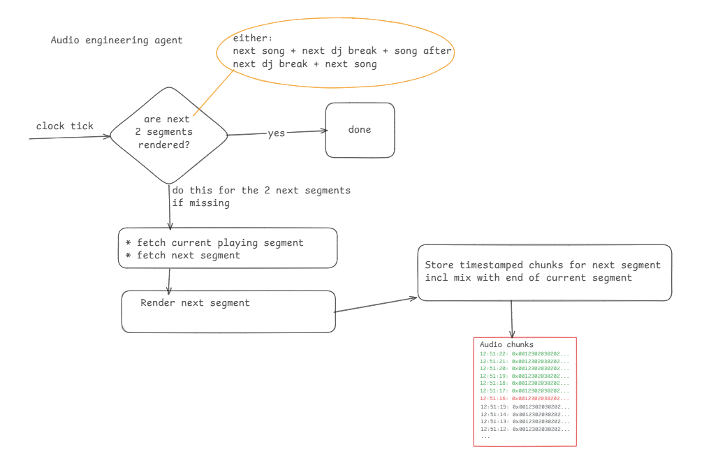

# Vibe Radio

Vibe Radio is an AI-powered radio station that maintains a planned queue of music and voice breaks, renders the upcoming audio continuously, and serves the correct timestamped audio chunk to listeners.

## Technology

- **Backend:** Python, FastAPI, Uvicorn, SQLAlchemy, PostgreSQL
- **Frontend:** React, TypeScript, Bootstrap, Vite

## System Architecture

The station is coordinated by three agents and a station backend:

- **Song selector agent** maintains a playlist with at least three queued songs. It considers listener requests, eligibility rules, playback history, and media-library availability. Missing tracks are downloaded before being queued.
- **Voice segment agent** creates DJ banter, news, jingles, replies, and other speech using text-to-speech. A playlist update is accepted only when the required upcoming voice segment is ready in time.
- **Audio engineering agent** renders audio ahead of playback. It joins the end of the current song, the next voice segment, and the start of the next song to create seamless transitions.
- **Station backend** maps the current clock time to a rendered audio chunk, serves station state at `GET /api/station`, and provides the audio stream to listeners.

## Playlist Planning

The song selector checks listener requests first. Eligible requested songs are verified against the media library, downloaded if necessary, and added to the playlist. When there are no usable requests, it selects a new song.

The agent checks the queue length after each update. It keeps adding songs until at least three songs are queued, then attempts the playlist update. Playback history is consulted to avoid unsuitable or recently played selections.

## Voice Segment Readiness

Every playlist update requires a valid voice segment for the next break or the point where the next song changes. If a suitable segment already exists, the update is complete. Otherwise, the voice segment agent marks the update pending and generates the segment.

The update becomes active only if voice generation completes in time. A late segment rejects the update, asks the song selector to replan, and preserves the existing playlist.

## Audio Rendering And Playback

On every clock tick, the audio engineering agent checks whether the next two segments are already rendered. If they are, it does nothing. Otherwise, it fetches the currently playing and next segments, renders the missing upcoming segment, and stores timestamped chunks.

Each rendered transition is one of these sequences:

- next song -> next DJ break -> following song
- next DJ break -> next song

The stored chunks include the mix between the end of the current segment and the start of the following segment. The station backend uses the clock to select and stream the appropriate chunk, so playback can resume at the correct position.

